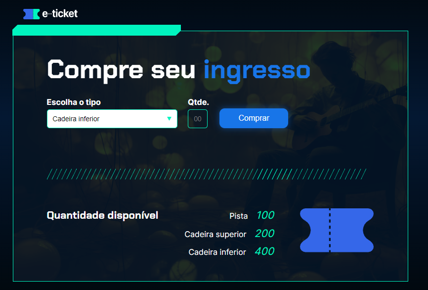

  

## 🚀 Tecnologias

Esse projeto foi desenvolvido com as seguintes tecnologias:

- HTML
- CSS
- JavaScript

## 💻 Projeto

e-Ticket
Bem-vindo ao e-Ticket! Este projeto é uma aplicação web simples para a compra de ingressos para eventos. Com uma interface amigável, os usuários podem escolher o tipo de ingresso desejado, a quantidade e realizar a compra de forma rápida e fácil.

Descrição
A aplicação e-Ticket permite aos usuários selecionar entre diferentes tipos de ingressos disponíveis, como cadeira inferior, cadeira superior e pista. O sistema controla a quantidade de ingressos disponíveis para cada tipo e atualiza essa informação conforme os ingressos são comprados.

Funcionalidades
Seleção do tipo de ingresso.
Escolha da quantidade de ingressos a serem comprados.
Exibição da quantidade disponível de cada tipo de ingresso.
Atualização dinâmica da quantidade de ingressos após a compra.

